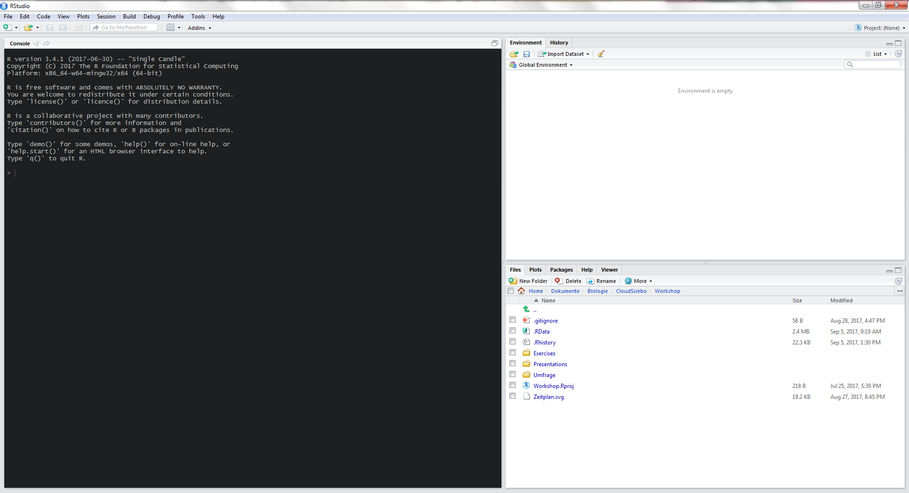

```{r setup, include=FALSE}
knitr::opts_chunk$set(echo = TRUE, message = TRUE, error = TRUE)
```


# Zeitplan

<!-- In kurzen Stichpunkten erklären, welche Themen in dem Workshop genau
behandelt werden. Zusätzlich die allgemeine Struktur und Ablauf klären sowie auf
die Übungsaufgaben hinweisen -->

***

* **09:45** Einführung in R mit Übungsaufgaben.
* **11:00** Datenaufbereitung mit Übungsaufgaben.
* **12:00** Mittagspause.
* **13:00** Datenverarbeitung.
* **14:00** Datenvisualisierung mit Übungsaufgaben.
* **16:20** Statistik.


## Literatur

* [R for Data Science](http://r4ds.had.co.nz/): Sollte unbedingt jeder lesen, der/die mit R Datenanalyse machen möchte.
* [ggplot2: Elegant Graphics for Data Analysis](https://www.amazon.de/ggplot2-Elegant-Graphics-Data-Analysis/dp/331924275X/ref=sr_1_1?ie=UTF8&qid=1505585504&sr=8-1&keywords=ggplot2): Gibt einen wesentlich detaillierteren Einblick, wie die Datenvisualisierung mit ggplot2 funktioniert. Nicht unbedingt notwendig, aber dennoch sehr empfehlenswert! Gibt es auch als PDF im Internet, enfach googlen ;).
* [Reproducible Research with R and R Studio](https://www.amazon.de/Reproducible-Research-Studio-Second-Chapman/dp/1498715370/ref=sr_1_1?s=books-intl-de&ie=UTF8&qid=1505585637&sr=1-1&keywords=reproducible+research+with+r): Möchte man ernsthafte bzw. umfangreichere Datenanalyse mit R betreiben, ist dieses Buch ajf lesenswert. Gibt es auch als PDF im Internet. Einfach googlen.
* [Handbook of Biological Statistics](http://www.biostathandbook.com/): Gibt einen sehr guten Überblick über Statistik in der Biologie und viele nützliche Informationen.
* http://rcompanion.org/handbook/ baut praktisch auf dem vorherigen Buch auf und zeigt die Anwendung in R.


# RStudio, eine IDE

<!-- Erklären, was RStudio eigentlich ist (Integrierte Entwicklungsumgebung),
seine Vorteile vorstellen und die Benutzeroberfläche erklären. -->

## ID... Was?

RStudio ist ein Editor, der speziell für die Nutzung mit R entwickelt wurde und einige nützliche Features besitzt:

>- Syntax-Highlighting
>- Code-Vervollständigung
>- Code-Faltung
>- Installation von neuen Paketen
>- Projektverwaltung
>- KOSTENLOS


## Die Oberfläche


<!-- Oberfläche interaktiv am Beamer zeigen und erklären. -->




# R, eine erste Einführung

<!-- -->

## Die Konsole

In die Konsole können wir Befehle eintippen und mit Enter an R schicken. Wir bekommen dann das Ergebnis zurück.

```{r}
1 + 1
```

***

Man kann selbstverständlich auch komplexere Ausdrücke eingeben.

```{r}
15 * 31 - 4^3
```

Einen Taschenrechner hat aber schon jeder.

## Objekte

```{r}
a <- 15
b <- 2

a * b

c <- a * b

c
```


## Vektore

Datensätze bestehen aber selten aus nur einer Zahl!

```{r}
a <- c(1, 2, 3, 4, 5, 6, 7, 8, 9, 10)

a
```

Dies nennt man in R einen Vektor. Jede Zahl stellt ein Element dieses Vektors dar.


***

Mit Vektoren kann man ebenfalls rechnen. Elementeweise:

```{r}
a + 1
```


***

Oder man verrechnet zwei Vektoren miteinander. Der kürzere wird recycelt.

```{r}
b <- c(0, 2)

a * b
```


## Datentypen

Datensätze bestehen ja nicht immer nur aus numerischen Werten, sondern auch aus Wörtern.

```{r}
d <- c("Grün", "Blau", "Gelb", "Rot")
```

Text bezeichnet der Informatiker als **Character Strings**.

## Character

Character verhalten sich anders als numerische Werte.

```{r}
"1" + "2"
```


***

Ein Vektor kann immer nur ganz genau **einen** Datentyp haben, also niemals Zahlen und Character gleichzeitig.

```{r}
c(1, "A")
```


Wir werden später sehen, wie man diese Einschränkung umgeht.

## Datentypen

Interessiert einen der Datentyp eines Objekts, kann man dies mit `typeof()` herausfinden:

```{r}
typeof(c(1, 2))

typeof(c("A", "B"))

typeof(c(TRUE, FALSE))
```


## factors - Kategorische Variablen

Nicht-numerische Variablen in der Datenanalyse sind i.d.R. kategorische Variablen mit einer begrenzten Anzahl an möglichen Ausprägungen. Diese werden in R durch `factors` dargestellt.

>- `factors` sind in R als Integer repräsentiert, welche zusätzlich ein *Label*, also einen Namen haben.
>- Die Kategorien, die ein `factor` haben kann, werden `levels` genannt. Dies ist also im Prinzip ein anderes Wort für **Kategorie**.


## Vorteile von factors

`factors` haben in einigen Situationen Vorteile gegenüber *Character-Strings*:

>- Da `factors` in R als Zahlen repräsentiert werden, haben sie eine Reihenfolge und werden nicht zwangsläufig alphabetisch sortiert.
>- Eine Kategorische Variable hat mehrere mögliche Ausprägungen (`levels`). Allerdings kommen in einer realen Messung nicht zwangsläufig auch alle Kategorien vor. Dennoch möchte man manchmal auch fehlende Kategorien in einem Diagramm darstellen.

***

`factors` werden durch `factor(x, levels)` erstellt.

```{r}
BodyColours <- c("Wildtype", "Yellow", "Ebony")

Measurement <- c("Wildtype", "Unknown", "Ebony", "Wildtype", "Ebony", "Ebony", "Ebony")
Measurement

Measurement <- factor(x = Measurement, levels = BodyColours)
Measurement
```

***

```{r}
table(Measurement, useNA = "always")

typeof(Measurement)
```

```{r, echo=FALSE, fig.height=2.5}
library(ggplot2)

ggplot(mapping = aes(Measurement)) +
  geom_bar() +
  scale_x_discrete(drop = FALSE)
```


## Weitere Datentypen

Neben numersichen Daten und Character Strings gibt es noch sog. **Booleans** oder auch **Logische Werte**.

>- Diese nehmen einen der beiden Werte TRUE oder FALSE bzw. 1 oder 0 an.
>- Diese logischen Werten sind später interessant, wenn man z.B. das Vorgehen an Bedingungen knüpft.
>- Mit Logicals kann man aus einem Vektor bestimmte Werte extrahieren.


## Subsetting

Man kann Elemente eines Vektors mit `[]` und der Positionsangabe bekommen.

```{r}
Measurement

Measurement[2]

Measurement[c(2, 5, 7)]
```

## Logical Subsetting

Alternativ kann man auch Logicals nutzen, um bestimmte Werte eines Vektors zu bekommen.

```{r}
Measurement

Measurement[c(TRUE, FALSE)]
```

***

Logical Subsetting ist vor allem dann interessant, wenn man nicht ein festes Muster, sondern eine Bedingung vorgibt.

```{r}
Measurement

Measurement == "Wildtype"

Measurement[Measurement == "Wildtype"]
```


## Listen

Und wenn ich zwei Datentypen in einem Datensatz habe?

```{r}
Liste <- list(c("A", "B", "C"), c(1, 2, 3))

Liste

typeof(Liste)
```

***

Listen können Vektoren mit verschiedenen Datentypen beinhalten.

Und sogar andere Listen!


## Dataframes

Aber es wäre ja viel intuitiver, wenn man Daten in Form einer Tabelle speichern könnte!

```{r}
Tabelle <- data.frame("Spalte 1" = c("A", "B", "C"),
                      "Spalte 2" = c(1, 2, 3))

Tabelle
```


***

Dataframes sind Rs Art und Weise, Tabellen darzustellen!

Im Grunde handelt es sich um eine Liste, in der die Vektoren als Spalten dargestellt werden!

```{r}
typeof(Tabelle)
```


## Kurzen Zusammenfassung

>- Datenreihen werden in R durch Vektoren dargestellt.
>- Jeder Vektor kann genau einen Datentyp haben.
>- Mehrere Datentypen können in einer Liste untergebracht werden.
>- Eine besondere Form der Liste ist der Dataframe.
>- Dataframes stellen Datentabellen dar. Jede Spalte ist ein Vektor mit einem Datentyp.

***

**ALLES, was in R existiert, ist ein Objekt.**


## Funktionen

Wir haben nun ein Format, um Daten zu speichern. Aber was machen wir mit diesen Daten?

```{r}
a <- c(1, 2, 3, 4, 5, 6, 7, 8, 9, 10)

mean(a)
sd(a)
```


***

Jede Funktion hat einen Namen und Argumente, die in Klammern dahinter stehen und durch Kommata getrennt sind.

```{r eval=FALSE}
function_name(argument_1 = value1, argument_2 = value2, ...)
```

***

Das ist analog zu Funktionen aus der Mathematik.

$$ f(x) = x^2 $$
$$ f(x, y) = x^2 + y $$


## Die Argumente

Jedes Argument hat einen Namen, eine Position und i.d.R. einen Standardwert.

```{r eval=FALSE}
help(mean)
```


***

**ALLES, was in R passiert, ist ein Funktionsaufruf.**

***

Funktionen können einfache Dinge tun, wie z.B. den Mittelwert berechnen.

Man kann aber auch verschiedene Funktionen kombinieren, um beliebig komplexe Abläufe zu erstellen.

***

Funktionen müssen nicht zwangsweisen Text oder Zahlen zurückgeben. Grafiken sind ebenso möglich.

```{r}
plot(a)
```


## Die Idee

Die Idee ist, dass wir ein oder mehrere Objekte (Daten) haben. Auf diese Objekte wenden wir sukzessive Funktionen an, bis wir das gewünschte Ergebnis haben.